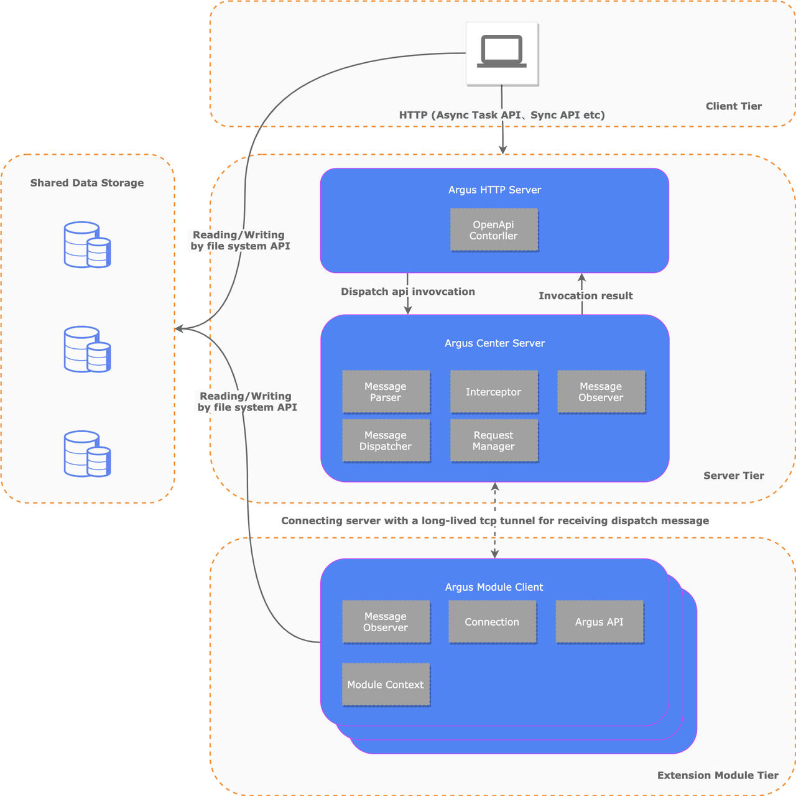

 

 

## 🚀 Introduction

Argus is a result review engine that prevents data leakage and ensures out-of-domain result traceability with functions such as sensitive data identification, data and AI model watermarking, and AI model-entrapped data scanning. It's the last line of defense for data leaving the domain, providing users with a strong guarantee.

Check out our website for detailed information: https://argus.idslab.io/

## 💻 Architecture Overview

## 🎉 Features

- Ease of use - Visualizing AI model structures and out-of-domain data, empowering users to accurately analyze and make informed decisions.
- Data traceability - By using data watermarking, Argus identifies data sources and tracks data flow to ensure the legality and traceability of data.
- Model traceability - Argus uses AI model watermarking to track model usage and authorization, ensuring legality and controllability.
- Strong scalability - Pluggable plug-in technology allows users to customize data detection tools for different extensions, providing scalability.
- Rule customization -  Users can customize data outbound rules to detect and process data according to their own requirements.
- Cloud-native - Argus supports Kubernetes deployment and provides powerful automation capabilities.

## 🤝 Join Community

Join argus community to explore related technologies and grow together. We welcome organizations, teams, and individuals who share our commitment to data protection and security through open source.

This is our QQ Group:  
