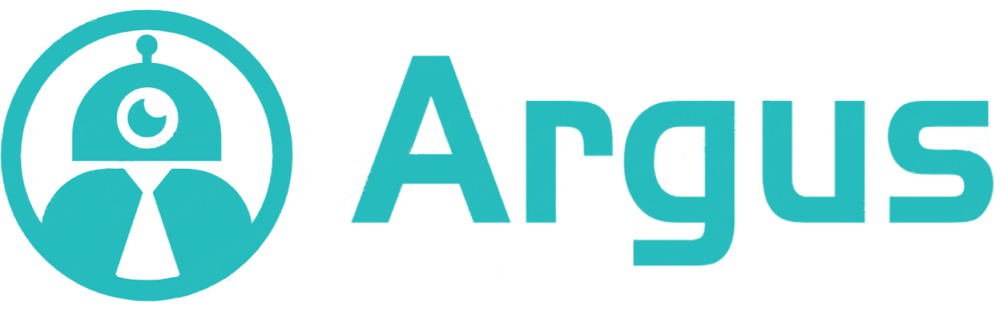
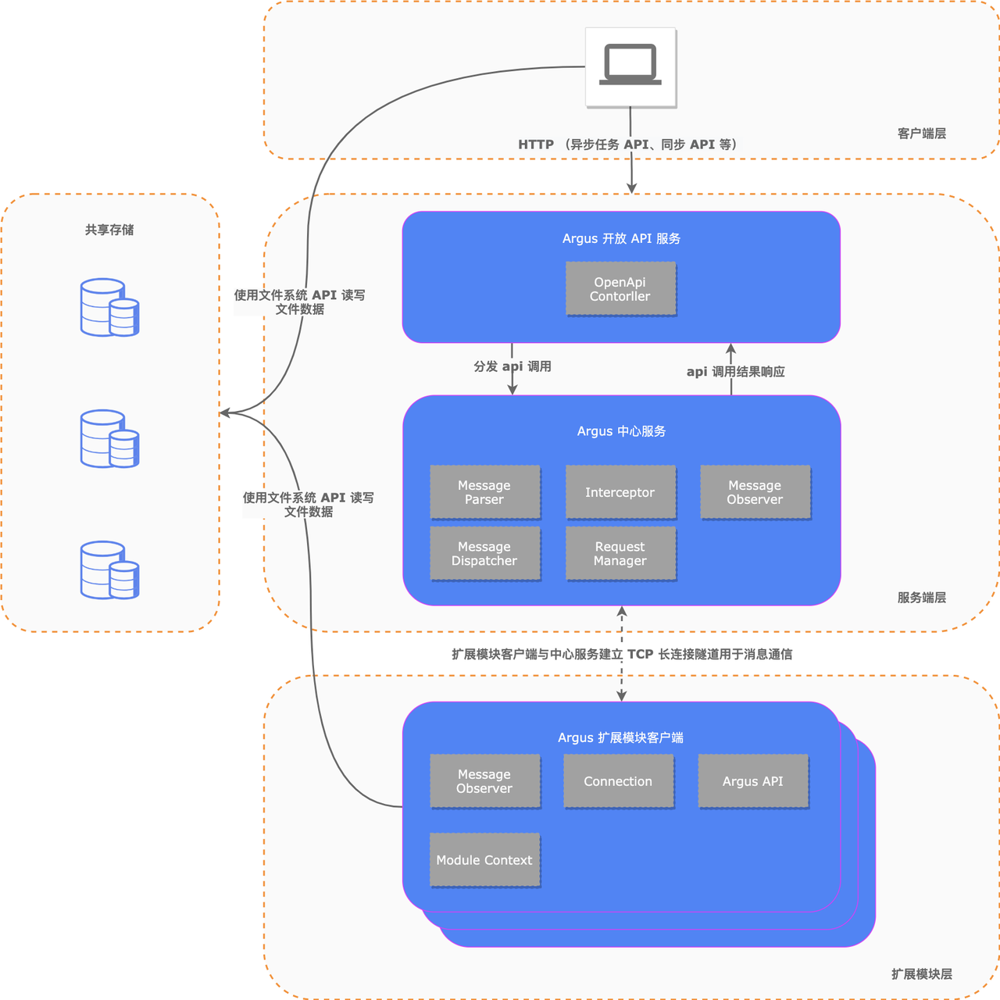

  

 

## 🚀 简介

Argus 是一个结果审查引擎，可通过敏感数据识别、数据和人工智能模型水印以及人工智能模型数据扫描等功能，防止数据泄露并确保域外结果的可追溯性。它是数据离开域的最后一道防线，为用户提供强有力的安全保障。

访问我们的网站了解详细信息： https://argus.idslab.io/

## 💻 整体架构图

## 🎉 特性

- 易用 - 可视化人工智能模型结构和域外数据，使用户能够准确分析并做出明智决策。
- 数据可追溯 - 通过使用数据水印，Argus 可识别数据来源并跟踪数据流，以确保数据的合法性和可追溯性。
- 模型可追溯 - Argus 使用人工智能模型水印来跟踪模型的使用和授权，确保合法性和可控性。
- 可扩展 - 可插拔插件技术允许用户为不同扩展定制数据检测工具，从而提供可扩展性。
- 规则定制 - 用户可定制数据外发规则，根据自己的要求检测和处理数据。
- 云原生 - Argus 支持 Kubernetes 部署，并提供强大的自动化功能。

## 🤝 加入社区

加入我们的数据沙箱社区，探索相关技术，共同成长。我们欢迎与我们一样致力于通过开源实现数据安全的组织、团队和个人加入。